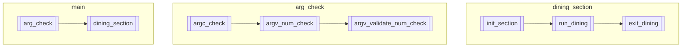

### main
- arg_check
	- 引数が適切なものであるかチェック
	- 不適切なものである場合、異常終了
- dining_section
	- 引数が適切である場合に、食事会場となるセクション。
	- 初期化時のエラー、異常終了

### arg_check
- argc_check
	- argcの個数をチェックする
	- 異常終了：5 or 6 でないとき
- argv_num_check
	- argv[1],argv[2],argv[3],argv[4],argv[5]について数値であるか確かめる
	- argv[5]はoptional
- argv_validate_num_check
	- argv[1-5]について、適切な値であるか判定
	- 適切な値 : 0 < input < 256
	- 上限値の理由
		- 2^8でキリが良いから。
		- シミュレーションを想定したときに、課題で求められる最大数が200であるから。

### dining_section
- `dining_overview.md`に食事会の概要を記載している。
- かんたんに
	- 食事会場を初期化する（哲学者・監視者生成、食事会場生成）
	- 食事会を行う
	- 食事会場を終了する（リリースの解放）
- init_dining
	- 食事会場の初期化
	- 初期化時のエラー（メモリ確保失敗、スレッド生成失敗など）で異常終了
- run_dining
	- 食事会中の挙動
	- 哲学者それぞれが食事を行う
	- 哲学者の誰かが死ぬ / 規定回数哲学者が食事を終える ことで終了する
- exit_dining
	- 食事会場のお片付け