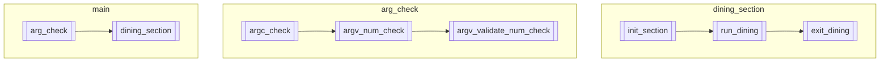

### main
- arg_check
	- 引数が適切なものであるかチェック
	- 不適切なものである場合、異常終了
- dining_section
	- 引数が適切である場合に、食事会場となるセクション。
	- 初期化時のエラー、異常終了

### arg_check
- argc_check
	- argcが5個か6個でない時、異常終了
- argv_num_check
	- argv[1],argv[2],argv[3],argv[4],argv[5]について数値であるか確かめる
	- argv[5]はoptional
- argv_validate_num_check
	- argv[1-5]について、適切な値であるか判定
	- 0以下は不適
	- (要調査)一旦はINT_MIN以下に値を設定。
		- 哲学者の数について、スレッドの特性を踏まえた制限を行うべき？

### dining_section
- `dining_overview.md`に食事会の概要を記載している。
- init_dining
	- 食事会場の初期化
	- 初期化時のエラー（メモリ確保失敗、スレッド生成失敗など）で異常終了
- run_dining
	- 食事会中の挙動
	- 哲学者それぞれが食事を行う
	- 哲学者の誰かが死ぬ / 規定回数哲学者が食事を終える ことで終了する
- exit_dining
	- 食事会場のお片付け