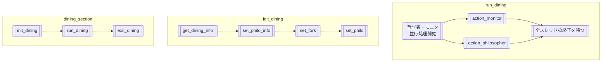

# dining overview

## dining_element

### dining_person (登場人物)
- 哲学者と監視者をスレッドとみなす。
- waiterは哲学者たちの中で同時に一人がアクセス可能な共有資源とみなす。

#### philosopher (哲学者)
- 思考 -> 食事 -> 睡眠 -> 思考を繰り返す。
	- 食事時間と睡眠時間と事前に規定されている。
	- 哲学者は常時、食事会の開催状態を無意識に確認している。
	- 最終食事時刻から規定時間空腹であると哲学者は死亡してしまう。
		- 食事会開始のタイミングにおいて、満腹であると仮定する。
- 思考
	- 思考中は暗黙的に食事のリクエストを行っていることとする。
		- 給仕より食事許可が出ると、自分の両隣にあるフォークを持ち食事を始める。
		- 給仕が食事状態を管理するため、哲学者がフォークを持つ時は必ず両方のフォークが持てると仮定。
		- 食事許可が出ない場合、考え続ける。
- 食事
	- 規定された時間分食事を行う。
	- 食事中に空腹時間がtime_to_dieに達してしまった場合、即座に死亡する。
	- 食事が完了した際に最終食事時刻が更新される。
	- 食事が終わったことを給仕に伝える。
- 睡眠
	- 規定時間睡眠を行う
	- 睡眠中に空腹時間がtime_to_dieに達してしまった場合、即座に死亡する。
	- 睡眠終了後、思考状態へ移行する。
- 各哲学者が持つデータ(each philosopher have same info about dining.)
	- philosopher_info
		- time_to_die
		- time_to_sleep
		- time_to_eat
		- must_eat_count  (option)
	- last_eat_time
	- eat_count
	- seat_number
	- is_alive
	- dining_state(ptr)
	- left_fork(ptr)
	- right_fork(ptr)
#### waiter (給仕)
- 思考中である哲学者を暗黙的な食事リクエストとみなす。
- 暗黙的な食事リクエストを受け取った場合、下記手順で食事可能か判断をする。
	- リクエストを行った哲学者の席番を確認する。
	- リクエストを行った哲学者の両隣にあるフォークの状態について確認する
		- 左のフォークが利用可能：右のフォークを確認（左の確認は続けている状態）
		- 右のフォークも利用可能：リクエストした哲学者に利用可能を通知
		- どちらかが利用不可：利用不可が分かった時点で、確認をやめる。
- 一度に1人の指示（暗黙的リクエスト、食事終了報告）を受け取ることが出来る。
#### monitor (監視者)
- 食事会中、哲学者の生存状態を監視する。
- 死者が出たら、即座に哲学者全員の食事を中止する。
- 死者が出た場合、10ミリ秒以内に検知する。
- 監視者が持つデータ
	- 哲学者全員のis_alive(ptr)

### dining_object
- fork
	- 哲学者の人数分用意されている。
	- 各哲学者の間に配置される。
	- 一度につき、一人しか所有できない。
- is_using
	- 各フォークが利用されているかどうか
	- 一度につき、一人しかアクセスできない。

### dining_state
- is_open
	- 食事会の開催状態 (OPEN/CLOSE)
	- monitorが操作を行う。下記状態時にCLOSEとする。
		- 参加中の哲学者の誰かが死亡した時
- seat_count
	- 哲学者が座る椅子の数。番号が振られている。

## dining_workflow
