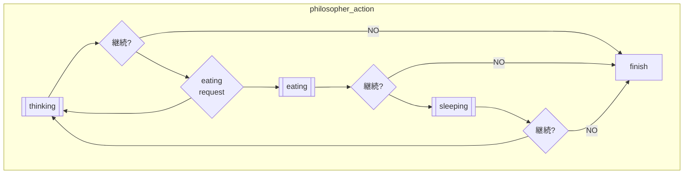

```mermaid
flowchart TD

subgraph philosopher_action

A_1[["thinking"]]
A_2{eating
request}
A_3[["eating"]]
A_4[["sleeping"]]
A_5[finish]
A_A_1{継続?}
A_A_2{継続?}
A_A_3{継続?}

A_1 --> A_A_1 --> A_2
A_2 --> A_1

A_2 --> A_3 --> A_A_2 --> A_4 --> A_A_3 --> A_1

A_A_1 --> |NO| A_5
A_A_2 --> |NO| A_5
A_A_3 --> |NO| A_5

end
```

## philosopher_action
### 継続条件
- 該当哲学者が死んでいない
- 該当哲学者の食事回数が規定回数を満たしていない
- 食事会場がオープンしている

### eating_request
- ウェイターに食事リクエストを出す
	- waiterがアクションをする。
- リクエストが通れば食事ができる
